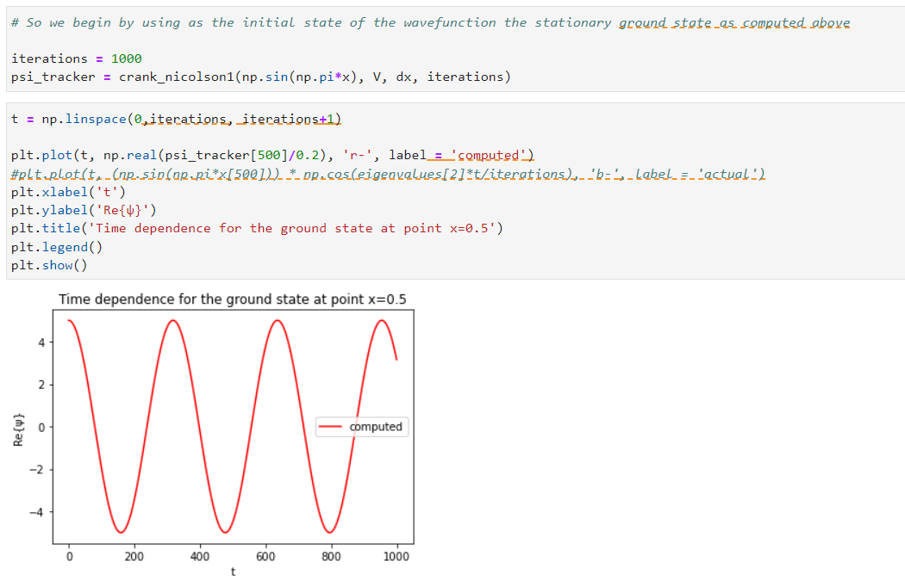

# Progress journal for PROJECT 3

## 23/05/2022

A piece of code solving the stationary Schrödinger equation has been created. The eigenvalues and eigenfucntions of an equation for an arbitrary potential V(x) have been succesfully obtained. A future summarized prospect of the project will be discussed below this same entry. First, further work in order to check the correcness of the code could imply the following.

* Solving the tridiagonal matrix eigenvalue problem manually instead of using a function contained in scipy library. (TODO)

Once we know how to solve a stationary problem we go to the next step of solving a time dependent problem. The way of proceeding will be following these steps. (TODO)

* Using the initial wavefucntion obtained via the stationary problem we give it as an input to the time evolution problem. This time, the potiential will also be time dependent so the wavefunction in the (original) stationary state will have to evolve.
* Depending on the speed of the change in the environment, the wavefunction will be able to (adiabatically) stay in the same eigenstate or diverge from it.
* How do we check the particle indeed stayed in the same eigenstate? We can solve the stationary problem for the final state and compare both cases.

Ideally it would be interesting to check the finite difference method procedure (itrating one step in time now for every full spatial domain iteration) via but another method. For non bounday conditions variationa and non time dependent potential V(x,t) we could use coefficient time evolution associated with the eigenfunctions, which can be found again using the stationay eignefunction solver. However, this last approach would only be useful to check the correctness of the time evolution finite difference method, not to let the quantum system evolve under an adiabatic change in the environment (we could solve a lot of stationary eigenproblems but that would not really be letting the system evolve in time).

The final upgrade to the technical part of the algorithm would be trying to implement an implicit method for the second derivative (Crank Nicolson) instead of the direct method based on the finite difference. This method avoids unstabilities of time dependent convergence. It also makes use of tridiagonal problem resolutions so the scipy library can be useful in this case too. We are also open to other further improvements that could be suggested to fit nicely in our project or any tip reagrding the exposed ideas.

Also, perhaps it is more convenient, once we reach this point in the project, to start with the adiabatic change proposed in Problem 10.8 in Griffiths book (2nd edition, pg. 391), in which they study the very slow lift of a potential pillar in the middle off the 1D infinite square well (slightly off-center) rather than the scheme depicted in Figure 10.2 (pg. 370) of this same reference, since the former only involves modifying the potential overtime and the latter also involves changing the length of the domain and therefore the length of the vectors used and the position of the (right part of the domain) bounday condition. This could be addressed more easily (i.e. not having to vary the bounday condition) initially putting a semi-infinite wall in the (say, half right part of the) domain and moving it to the right but then the fact that the potential of the wall is infinite turns out to be difficult to impose. We could then work with the finite quantum well approach (solving for the eignevalue problem analogously) although we will let this discussion to conclude whenever we try with this approach.

The realization of the other two ideas we mentioned as an upgrade of the first result are also still considered. These ideas involve the following (independent) points.

* Analyze a more complex system (like a particle enclosed in a 3D sphere and letting it expand/shrink or any other idea we may come up with).
* Implement an animation that allowed us to see the time evolution in any of the -fast or slow- cases.

These ideas have not been tested yet but their realization does not seem to be able to induce a lot of technical problems at first glance.

## 27/05/2022

In this time lapse we checked the performance of the Schrödinger eigenproblem solver of last week. Indeed when we use a potential $`V=0`$ and we compare the results with the analytical expression, after normalizing the ground state wavevector we find complete agreement. We can therefore conclude that our eigensolver for the Schrödigner equation in 1D works correctly.

We also did some further work in our code, which consists of the following:

* We solved the time independent Schrödinger eigenproblem for a system with a semiinfinite potential barrier, with bottom of the well at $`V=0`$, the top of the well at $`V=10000`$ and the turning point at $`\tilde{x}_t=0.5`$. This potential shape can be seen in the figure below.

* We used the ground state of the particle to let it evolve under adiabatic and non-adiabatic motion of the step well. This motion was controlled by a parameter $`v`$ which accounts for the velocity in which the potential non-infinite barrier moves to the positive direction in the $`\tilde{x}`$ axis. The time evolution of the particle was obtained by means of solving the time dependent Schrödinger equation. This has benn done using the Crank-Nicolson implicit discretization and solving the set of equations using linear algebra matrix operations.

* The result can be seen in the two gifs that we display below. For the first one (top) we see the potnetial barrier moving adiabatically ($`v=0.01`$) and for the second (bottom) we see the potential moving fast (non-adiabatically, $`v=100`$). Clearly, the adiabatic theorem holds in this case, although we should formally compare the final stages of each evolution with the result of solving the eigenproblem for the zero potnetial case ($`V=0`$). Note that so far we always mantain the boundary conditions untouched, i.e., there is always an infinite square well containing the particle with limits $`\tilde{x}=0`$ and $`\tilde{x}=1`$.

## 27/05 and onwards

The problem of the splitting infinite well was studied. More precisely, our study was based on the paper **"Splitting the wave function of a particle in a box, Julio Gea_Banacloche (2001)**.
As it can be found in the paper, the problem consists of an infinite potential well [0,L]. At time t=0, a potential wall starts to build up around the middle of the well. The time dependent potantial can be formulated as: **V(x,t) = b*t (b constant) for x in [-ε, +ε + δ]** and **V(x,t) = 0 , elsewhere**. We see that we have introduced a small asymmetry δ towards the right half section of the well such that **δ << ε << L**. As we will see this asymmetry leads to some very interesting results. In our work we study the behaviour of the **ground state** for two different occasions:

**a) Adiabatic:** The potential builts up very slowly (small b) and the wavefunction remains constantly at the ground state of the _corresponding_ Hamiltonian. In other words, time acts just as a parameter in the Hamiltonian.

**b) Non-adiabatic:** Abrupt built-up of the potential barrier (large b). The wavefunction is not expected to remain in the ground state.

If we focus on the stationary ground states, we expect the wavefunctions to become more and more confined on the larger section of the well (left) in order to minimize their energy (see paper for more details). In the limit V --> inf we expect the ground state wavefunction to be completely confined on the left part of the well.

So, in our approach to the problem we followed the following steps:

**Step 1: Discretization and solution of the stationary problem**

We discretized the domain of the well wich led to the transformation of the Hamiltonian operator into a matrix. We adjusted the Hamiltonian matrix to fulfil the BCs **ψ(0) = ψ(L) = 0**. This leads to the following form:

The Hamiltonian matrix is built by ham_1D_well function in functions2.py (see there for more details)

Using this Hamiltonian we solved the eigenvalue problem **HΨ = ΕΨ** for V(x) = 0 (infinite well) for which we know the analytic solutions and thus we can compare how well our method works. The first three eigenfunctions we obtained are depicted here:

They match very well the eigenfunctions of the infinite well.
As for the eigenvalues the first three were:

Since we are working in natural units (h = m = 1) and for well length L=1, the eigenvalues are given analytically by the formula: **E(n) = n^2 * π^2/2**. By this we obtain: **E1 = 4.9348, E2 = 19.7392, E3 = 44.4132** for the three first (theoretical) eigenvalues of the Hamiltonian. Comparing with the ones we computed (seen above) we see that we have very good accurancy, especially for the ground state on which we will focus. For higher states the theoretical and the computed eigenvalues follow the patterns seen bellow:

From these pictures we infere that the occurancy of our method remains pretty good up to n~100.

**Step 2: Crank - Nicolson time evolution**

In these step we develop the Crank _ Nicolson function in order to introduce the time dependent wall-potential and solve the time dependent Schroedinger equation. More details can be found as comments in week3.py and in functions2.py but in general we compute the wavefunction-vectors in each timestep by using the Crank - Nicolson formula:

Where Hd is the Hamiltonian matrix shown before.

To check how well our method works we plug in, as initial ψ, the first few eigenstates of the infinite well and plot their **real** part. The stationary eigenfunctions should only obtain a **phasor exp(i*En*t)** and thus the real part should exhibit a harmonic oscillation with time as A(x)*cos(En*t) where the amplitude depends on wich point of the grid we are. We present the following results for n=1 at x=0.5 and n=2 at x=0.2:

We clearly see that both the amplitudes and the frequencies of the oscillations match the states and the points of the grid.

**Step 3: Implementation of the time dependent barrier potential**

At this point we are ready to apply the time dependent potential wall. As it can be seen in functions2.py (crank_nicolson1 & crank_nicolson3) this is done by re-evaluating the Hamiltonian matrix in every time step. More precisely, we create a potential V(x,t), for each timestep, as described in the beginning. Our grid consists of 1001 points and the potential is applied to the region between 450 and 555 (δ=50, ε=5). Once the potential V(x,t) for the given timestep is made (array((N+1),)), we plug it in ham_1D_well function to create the corresponding Hamiltonian matrix. This proccess is repeated in every timestep until we obtain our time-dependent wavefunction ψ(x,t).

Now it is time to study the behaviour of the wavefunction in the adiabatic and the non-adiabatic case. In the **adiabatic** case we set **b = 1 or 2 or 4**, while in the non-adiabatic we set it at **b=30 or b=10**. 
For the first couple of timesteps the qualitative picture can be viewed in the following gifs:

**i) Mostly ADIABATIC (b=4)**:

**ii) NON-ADIABATIC (b=30)**:

It is visible that in the adiabatic case the eigenfunction tends to confine itself in the left section of the well, as we expected it to do by following the ground eigenstate of the system. In the non-adiabatic case we indeed do not observe the same behaviour.

By setting **b=1** we obtain the following figures for |Ψ| & |Ψ|^2, at times t=20,100,300,500,700,1000:

Where the height of the potential wall does not correspond to the values of the vertical axis. Its real value is 500 times larger.

We can also compare the wavefunctions obtained, when a wall of a certain height is built in 1000 timesteps (adiabatic --> b=1) vs when the same wall is built in 100 timesteps (non-adiabatic --> b=10):

We again observe the same patterns.

**Step 4: Quantitative analysis of the results**

Now we would like to analyze the results a little more quantitatively to acquire more solid evidence that what we did was correct.
Therefore, in each Crank - Nicolson loop we track the (ground-state) **eigenvalues** of the corresponding (timestep-dependent) Hamiltonian matrix (1). Likewise, we compute the **expectation values** of the Hamiltonian for the state that the time-dependent wavefunction is at each timestep (2).

In general, the values obtained by (1) and (2) coincide only when the wavefunctions happens to be an eigenstate of the Hamiltonian in this very timestep. Thus, we expect them to coincide fot the adiabatic case but not for the adiabatic one. Indeed, these are the results we obtain:

It is also clear from the graphs above that after many timesteps when the potential is very large the energy approaches values of around 22. This is important since the energy is proportional to **L^-2**, where L is the length of the well. When the wavefunction is confined in the right section of the well, the effective length is halved (less than halved at 450/1000). We thus expect the eigenvalues of the enrgy to be a little bit more than 4 times larger. And so they are:

These are the values for t=1000. We remind that for the full well in ground state they were ~ 4.9. This further validates our results.

Finally, we derived the errors of the energies we computed for each timestep. Our derivation can be found in the picture bellow and the results in the plot after:

We observe that our errors range from 0 to 0.009.

Sidenote: The simulation for system 1 is already completed. Apart from the qualitative result given by the ploted time evolution of the system (gif), an anaysis involving the energies of the system has been made, pointing put what had to be satisfied in each case (adiabatic and non-adiabatic evolution)

A first verion of the presention slides has been uploaded, but it is not yet definitive. We hope to finish them by the deadline, or as soon as possible otherwise.
